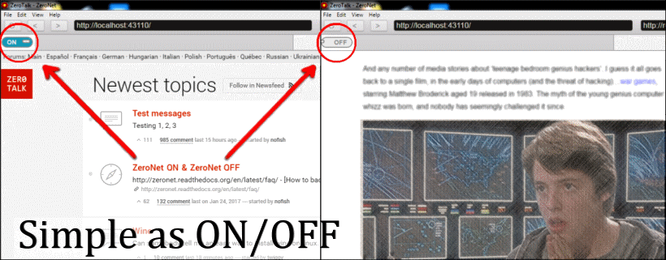
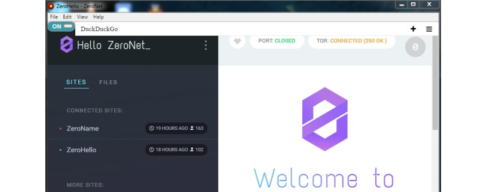

<div align="center">
  <br><br>
</div>

## Fuzium 

A fusion of Electron and Zeronet, with more goodness to come.


### Why?

 * What could be better than combining our favorite opensource technologies. 
 * The name is a play on Chromium which Electron is built on.

 
### What's new?

- (Feb 1, 2017) Merged in [Min Browser](https://github.com/minbrowser/min) which uses [DuckDuckGo](https://duckduckgo.com/)
  for extra privacy and instant answers.<br>
  It's a ['smarter, faster'](https://minbrowser.github.io/min/) address bar which suits
  this project perfectly. :surfing_man:
  <br>
- (Feb 5) New homepage, ready for app store (1LANDERvVWbShpNWpsrbBvfqSK1PabXtwv)
  <br>
- (Feb 11) Merged in bookmarking with [Vue.js](https://github.com/coligo-io/bookmarking-app-electron-vuejs-firebase)

### Todo

- [x] config & debug logging
- [x] saves user windowing config
- [x] user preferences & about screen
- [x] download handler (no gui yet)
- [x] packaged releases (pre-alpha)
- [x] addressbar (surf's up! :)
- [x] a newly designed homepage
- [x] bookmarks & notepad
- [ ] zite bookmark sharing & rating
- [ ] featured apps & store (altcoins)
- [ ] test Chrome extensions & zeronet plugins
- [ ] site creation tools & widgets
- [ ] view console info as sub-windows
- [ ] cross platform testing


### Bugs (v0.0.6)

 * Hide bookmarks when using tabs.
 * Opening a zite in the address bar creates additional toggle switches and sidebar buttons.
 * Need to reload (CTRL-R) occasionally after starting if zeronet boots up late.

 
### Features

 * [Min browser's](https://minbrowser.github.io/min/) 'instant answers' address bar with DuckDuckGo integration.
 * taskbar preferences
 * win32 installer or zip
 * bookmarking tool

### Samples

 
 <div align="center">
  <br><br>
 </div>

 
 -----
 
 
 <div align="center">
  <br><br>
 </div>


### Install

```
git clone https://github.com/kustomzone/Fuzium.git
cd Fuzium
npm install && npm start
```

### Test Releases

 - [Fuzium-v0.0.5-win32-installer](https://github.com/kustomzone/Fuzium/releases/tag/v0.0.5-pre-alpha)
 - [Fuzium-v0.0.3-win32-zip](https://github.com/kustomzone/Fuzium/releases/tag/v0.0.3-pre-alpha)


### OS Platform Status / Notes

| **`Linux`** | **`Mac`** | **`Win`** |
|-------------|-----------|-----------|
| not running | not running | running  |
|  (afaik)    | [issue #4](https://github.com/kustomzone/Fuzium/issues/4) |Ctrl-R to reload|


Report any [issues](https://github.com/kustomzone/Fuzium/issues) you come across, thanks.


#### Thank you!

 - [PalmerAL](https://github.com/PalmerAL), for the [Min Browser](https://github.com/minbrowser) components.
 - Tamas Kocsis, creator of Zeronet ( https://zeronet.io )
 - Cheng Zhao, creator of Electron ( http://cheng.guru/ )
 - Plus Github and the rest of the team working on Electron


License
-------

- Kustomzone Production, MIT license.
- Contact: fuzium @ kustomzone.com

