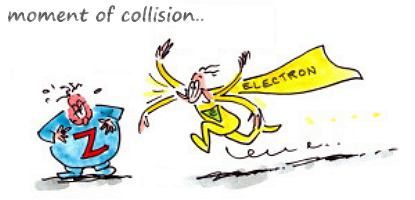

<div align="center">
  <br><br>
</div>

## Fuzium 

Fusion of Electron and Zeronet into something new. 【WIP】


### Why?

 * What could be better than combining our favorite opensource technologies. 
 * The name is a play on Chromium which Electron is built on.


### Todo

- [x] download folder
- [ ] navigation (forward/backward)
- [ ] addressbar
- [ ] stop zeronet from also loading in default browser!
- [ ] redesign
- [ ] site creation
- [ ] new app toplist
- [ ] app/site donations
- [ ] cross platform testing
- [ ] packaged releases


### Features

 * (testing)


### Screenshot

 * (soon)
 

### Install

 * (pending)

```
git clone https://github.com/kustomzone/Fuzium.git
cd Fuzium
npm install && npm start
```


### Status

| **`Linux`** | **`Mac`** | **`Win`** |
|-------------|-----------|-----------|
|             |           |  running  |
|-------------|-----------|-----------|
|             |           |alt-key for|
|             |           |menu+reload|


#### Thank you!

 - Tamas Kocsis, creator of Zeronet ( https://zeronet.io )
 - Cheng Zhao, creator of NW.js and Electron ( http://cheng.guru/ )
 - Plus Github and the rest of the team working on Electron

License
--------------------------------------

Fuzium is released under the MIT License.
